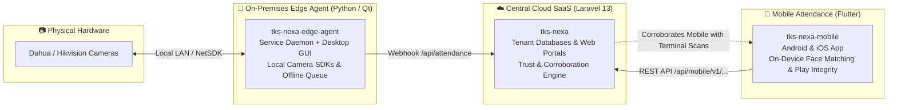
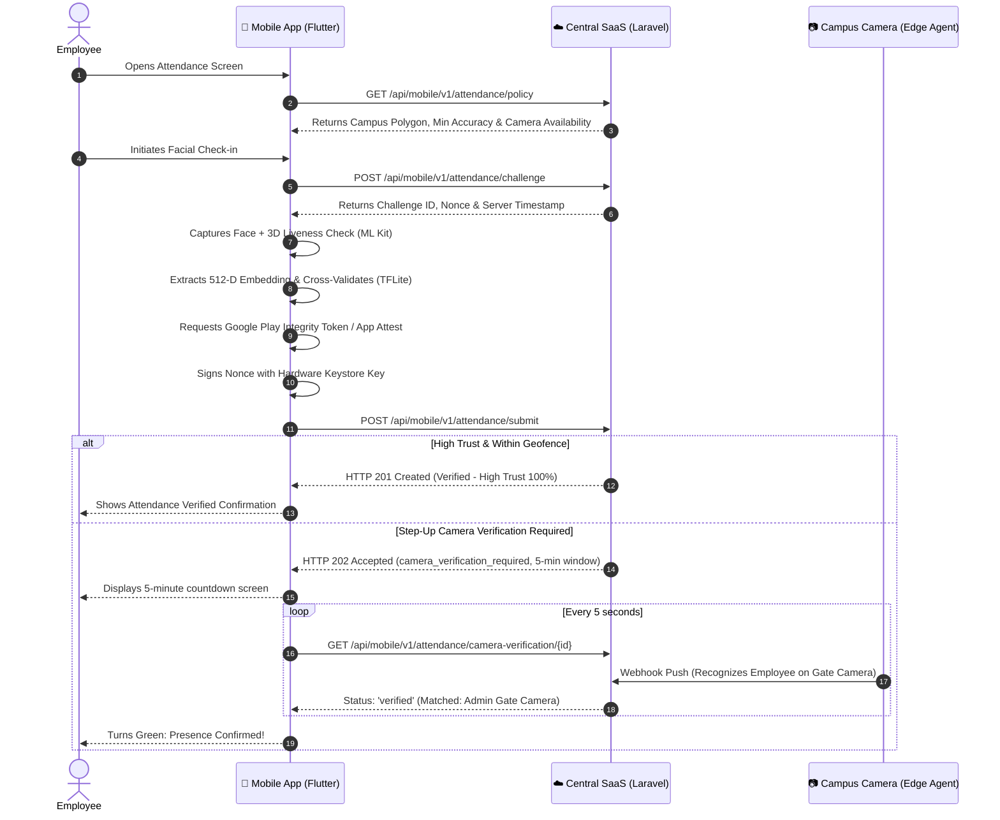

<p align="center">
  <h1 align="center">📱 TKS Nexa Mobile Attendance</h1>
  <p align="center">
    <strong>Cross-Platform Biometric Mobile Attendance & Identity Verification Client</strong>
  </p>
  <p align="center">
    <a href="https://flutter.dev"></a>
    <a href="https://dart.dev"></a>
    <a href="https://riverpod.dev"></a>
    <a href="https://www.tensorflow.org/lite"></a>
    <a href="#"></a>
  </p>
</p>

---

## 🌐 The TKS Nexa Ecosystem

The **TKS Nexa** enterprise attendance infrastructure consists of three interlinked systems:



- **[Central SaaS Repository](https://github.com/TheKhanSoft/tks-nexa)**: The central multi-tenant cloud application, attendance trust scoring engine, and admin/employee portals.
- **[Edge Agent Repository](https://github.com/TheKhanSoft/tks-nexa-edge-agent)**: The on-premises bridge connecting physical terminal hardware with the central cloud.
- **Mobile App Repository (This Repo)**: The Flutter mobile application for verified employee attendance.

---

## 📖 Overview

**TKS Nexa Mobile Attendance** is an enterprise, multi-tenant mobile application built with Flutter. It enables employees to securely verify and submit their attendance directly from their smartphones using **On-Device Edge Facial Biometrics, 3D Liveness Detection, High-Accuracy Polygon Geofencing, Google Play Integrity / Apple App Attest, and Cryptographic Hardware Signatures**.

> [!IMPORTANT]
> **Zero Server GPU Processing**: Biometric face detection and embedding vector extraction run completely **on-device** using Google ML Kit and TensorFlow Lite. The Central SaaS never receives raw camera video streams, preserving bandwidth, privacy, and server resources.

---

## ✨ Key Capabilities

1. **Multi-Tenant Discovery & Authentication**:
   - Dynamic tenant lookup via signed central directory (`/api/tenant-list`).
   - Quick organization switching with QR Code scanning.
   - Secure multi-identifier login (Email, CNIC, Employee ID, or Username) using Laravel Sanctum bearer tokens.
2. **On-Device Edge Biometrics (TFLite & ML Kit)**:
   - Real-time 3D facial liveness detection to prevent photo and screen presentation attacks.
   - On-device 512-dimensional facial embedding vector extraction.
   - Local cosine similarity verification against the employee's securely enrolled template.
3. **Polygon Geofencing**:
   - Supports arbitrary, complex convex and concave campus/office polygon boundaries.
   - Evaluates perpendicular distance to boundary and handles GPS settling gracefully when the accuracy circle overlaps the boundary (`boundary_uncertain`).
4. **App & Device Integrity**:
   - Integrates with **Google Play Integrity API** (Android) and **Apple App Attest** (iOS) to detect rooted devices, emulators, and compromised operating environments.
   - Hardware Keystore / Secure Enclave cryptographic signing of attendance challenge nonces.
5. **Adaptive Camera Corroboration**:
   - When required by tenant risk policy, the app initiates a step-up camera verification countdown.
   - Live polling tracks when physical on-campus terminal cameras corroborate the employee's presence on-site.

---

## 📂 Repository Structure

```text
lib/
├── app/                       # App composition, routing & global themes
│   ├── app.dart               # Root MaterialApp with theme & router injection
│   ├── router.dart            # GoRouter configuration & route guards
│   └── theme.dart             # Modern dark/light design system
├── core/                      # Core infrastructure & platform services
│   ├── config/                # Compile-time environment configuration
│   ├── errors/                # Strongly-typed failures and error mappers
│   ├── network/               # Dio HTTP client, interceptors & auth tokens
│   ├── platform/              # Native platform bridges (Android/iOS)
│   ├── security/              # Cryptographic signing, Keystore & Play Integrity
│   └── storage/               # Encrypted OS-backed storage (flutter_secure_storage)
├── features/                  # Clean Architecture Feature Modules
│   ├── account/               # Employee profile, trust stats & credential settings
│   ├── attendance/            # Attendance workflow & verification
│   │   ├── application/       # Riverpod state notifiers, timers & controllers
│   │   ├── data/              # Attendance API client & DTO mappers
│   │   ├── domain/            # Entities (Policy, Location, Evidence, Challenge)
│   │   └── presentation/      # Punch screen, Camera UI, Step-up timer dialog
│   ├── auth/                  # Authentication & session management
│   │   ├── application/       # Auth state provider & session restoration
│   │   ├── data/              # Login/logout API repository
│   │   ├── domain/            # User & Employee credential models
│   │   └── presentation/      # Multi-tenant login & forgot-password screens
│   └── organization/          # Tenant discovery & workspace selection
│       ├── application/       # Active tenant state & persistence
│       ├── data/              # Directory API & local tenant storage
│       ├── domain/            # Tenant & Domain entities
│       └── presentation/      # Organization search, QR scanner & confirmation
└── main.dart                  # Application entrypoint & dependency bootstrap
```

---

## 🔄 End-to-End Attendance Lifecycle



---

## 🚀 Getting Started

### Prerequisites
- **Flutter SDK**: 3.19.x or higher (Dart 3.x)
- **Android Studio / Xcode**: Configured for Android and iOS builds.
- **Physical Device**: Required for testing Camera, GPS, Keystore, and Play Integrity.

### 1. Installation

```bash
# Clone the repository
git clone https://github.com/TheKhanSoft/tks-nexa-mobile.git
cd tks-nexa-mobile

# Fetch Flutter dependencies
flutter pub get
```

### 2. Environment Configuration

Copy the example environment configuration:

```bash
cp config/development.example.json config/development.json
```

Update `config/development.json` with your central server URL:

```json
{
  "environment": "development",
  "centralBaseUrl": "http://10.0.2.2:8000",
  "allowSelfSignedCertificates": true,
  "enableSecurityBypass": false
}
```

### 3. Running the App

```bash
# Run on an Android device/emulator
flutter run --dart-define-from-file=config/development.json

# Run on an iOS device/simulator
flutter run -d ios --dart-define-from-file=config/development.json
```

### 4. Running Automated Tests

```bash
# Run unit and widget tests
flutter test

# Run integration tests on connected device
flutter test integration_test/app_test.dart
```

---

## 🔒 Security Architecture

1. **Tamper Detection**: Debug flags and mock location providers are strictly rejected in production builds.
2. **Secure Enclave Storage**: Authentication tokens and device keys are stored exclusively in Android Keystore (via EncryptedSharedPreferences) and iOS Keychain.
3. **Replay Attack Resistance**: All submission payloads incorporate a single-use server nonce signed by the private key of the bound device.

---

## 📄 License

Proprietary enterprise software developed by **TheKhanSoft**. All rights reserved.
